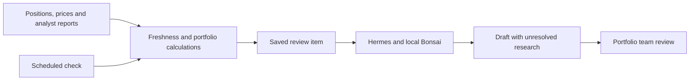
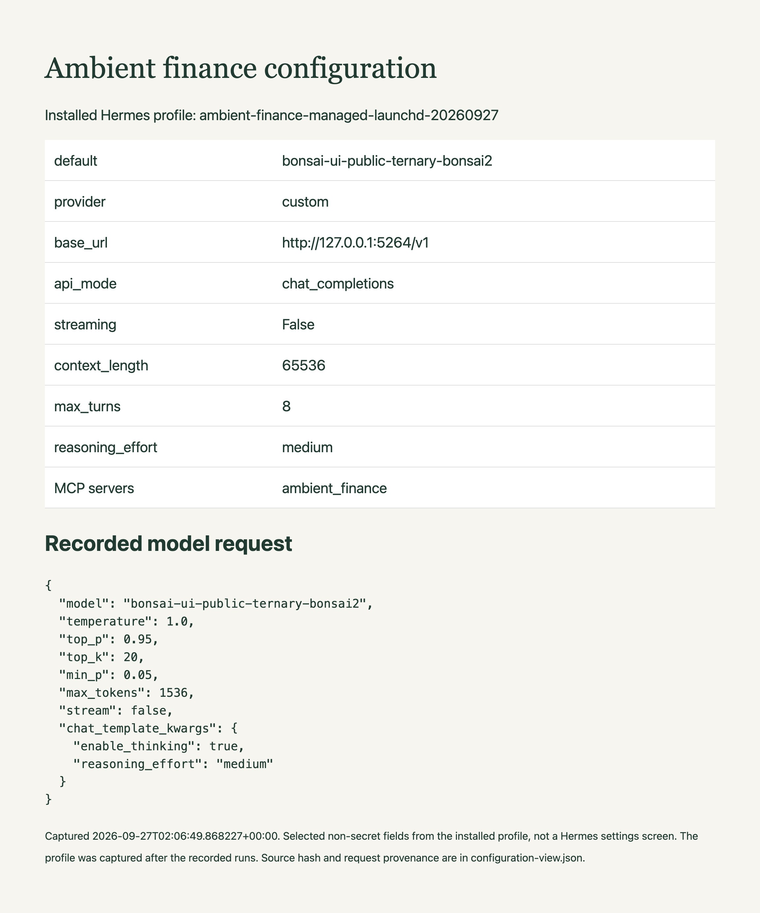

# Prepare the portfolio review before the team arrives

Schedule the position, scenario and research checks your team repeats before an investment review. The agent saves a draft explaining the exposure and the unresolved research, so the reviewer can focus on the assumptions and decisions that need attention.

## What the reviewer receives

The sample portfolio is worth $640,800, with a $300 change from the listed prior closes. Its downside scenario loses $70,232 under the supplied shocks. The Meridian research note is older than the methodology permits, so the review asks who will obtain an update and by when. The saved calculation and source references remain available beside the draft.

The [recorded scheduled run](evidence/managed-launchd-20260927/README.md) includes the saved draft, source record, request usage and verification results.

## How preparation works



A scheduled calculation can already flag concentration or stale research. Here Python performs those checks, and the model explains their implications using the cited report pages and model rows. The saved item preserves the inputs behind the explanation. A fixed dashboard is simpler for recurring metrics; the agent adds value when an exception requires source reading and a proposed follow-up.

The [architecture walkthrough](docs/architecture.md) explains the components, persistence and failure handling. Hermes runs the agent loop, while the local Bonsai endpoint supplies reasoning and tool selection. The scheduler and application code control when work starts and what gets saved.

## Try the sample workflow

```sh
git clone https://github.com/ChaiWithJai/bonsai-hermes-ambient-finance.git
cd bonsai-hermes-ambient-finance
python3 scripts/make_mock_sources.py
python3 run_schedule.py --cadence nightly --as-of 2026-09-25
```

The command saves `runs/2026-09-25-nightly.json` with the values above and status `review_required`. The inputs are sample holdings, prices and reports dated September 25. Python 3.10 or newer runs the calculation; PDF reading also needs Poppler. Follow the [setup guide](docs/setup.md) to add the model draft to this work item, then the [managed service guide](docs/managed-service.md) to start and stop inference automatically for due reviews. Current source data are a prerequisite for a live schedule. The [architecture](docs/architecture.md) explains stale-data handling and same-day retry limits.

## Why these model settings

Bonsai supplies the language reasoning and tool selection; the application checks the facts it can verify in code. The reference run uses Ternary Bonsai 2 27B in PQ2_0 format on an M5 Pro with 48 GiB of memory. The model and matching Prism runtime are a reproducible starting point for a workstation deployment.

The [parameter guide](docs/parameter-guide.md) explains temperature, sampling, context, reasoning budget and tool limits, with sources and a task-specific evaluation plan. The settings follow the publisher's thinking-mode guidance. The workflow has been exercised with them, but a controlled comparison has not established an optimal configuration for legal or finance work.



The [configuration record](docs/recorded-configuration.md) identifies the profile and request fields used to produce this reference view.

## Find the code and extend it

| Location | What to change |
| --- | --- |
| `finance.py` | Portfolio arithmetic, source checks and read-only model tools. |
| `run_schedule.py`, `scheduler.py` | Work-item persistence, cadence and retry behavior. |
| `managed_tick.py` | Model startup, readiness checks and cleanup. |
| `review.py` | Human decisions and acceptance checks. |
| `fixtures/`, `sources/` | Sample inputs and generated report files. |
| `config/`, `scripts/` | Agent settings, service helpers and sample generation. |
| `tests/` | Source, persistence and scheduling regression checks. |
| `docs/`, `evidence/` | Operating guides and recorded runs. |

Run `python3 -m unittest discover -s tests -v` after changing the workflow. Keep generated drafts and runtime state in their configured data directories; the source checkout contains the implementation and sample inputs.
