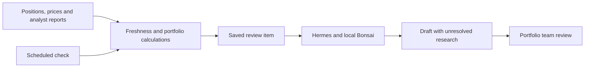

# How a portfolio review is prepared

The workstation prepares a dated review for a portfolio manager. Python calculates exposures and stated scenarios, while Hermes asks local Bonsai to explain the positions and unresolved research. The saved draft gives the manager source identifiers and the decision that still needs attention.

## Sources and calculations

`AMBIENT_FINANCE_DATA` selects the input directory; the repository directory is the default. `fixtures/portfolio.json` supplies holdings, prices, limits and scenario shocks. `fixtures/research.json` supplies research dates, catalog summaries and source-document paths. The position tool extracts PDF text with Poppler and reads CSV rows, returning that content separately from the catalog summary. The source reader rejects paths outside the selected input directory.

`finance.calculate` checks prices and research before returning the calculation. Stale prices block generation. Stale research permits a draft describing the issue but prevents acceptance. Work items record source hashes and their effective date. The sample-input generator creates explicitly dated mock prices; neither the generator nor the scheduler refreshes market data automatically.

The position tool reads the configured source directory during generation. Keep that directory unchanged for the duration of a review. The work-item hash records do not provide an immutable source snapshot, so concurrent source refresh and analysis require a separate snapshot mechanism.

## Model and tools

`run_schedule.py` writes the deterministic work item before invoking Hermes and names its exact run ID in the prompt. `finance_latest_run` returns that work item and its unresolved source requirements. `finance_position` returns a selected position, catalog research and extracted source content. Both tools are read only.

Hermes calls the loopback proxy on port 5264, which forwards to Bonsai on port 62737. The proxy applies `config/sampling.json` and records full requests and responses under `exchanges/`. Those records can contain supplied portfolio data and must follow the workstation's access and retention rules.

If the model stops with reasoning but no answer, the proxy makes one corrective request with thinking and tool calls disabled. It preserves both attempts and combines their token usage when recovery succeeds. A second incomplete answer becomes an error. Reasoning is never copied into the answer. The corrective branch has CPU regression coverage; the recorded successful retry did not exercise it.

After Hermes exits successfully, the worker finds the new session for the submitted prompt and requires a saved final assistant answer. CLI stdout alone is insufficient. The saved answer still needs factual and human review. Native model tracing is separate from the HTTP captures and the MLflow artifact evaluation records in this repository.

## Persistence and review

`AMBIENT_FINANCE_RUNS` selects the work directory; `runs/` is the default. Setup and the LaunchAgent installer preserve the configured directories so the scheduler, worker and MCP tools read the same data. Direct CLI commands need the same environment settings.

A per-item file lock prevents concurrent workers from overwriting a work item. Reports are written through an atomic rename. Model retries archive the previous attempt before clearing its obsolete draft. Completed drafts remain unchanged. Failed or interrupted model attempts can receive two automatic retries when the source hashes still match.

The review command checks that a completed draft exists and that source and portfolio issues are resolved before accepting analysis. Reviewer names are entered text, not authenticated identities. A review decision does not authorize trading, and the exposed tools provide no trade execution operation.

## Scheduled model lifecycle

The scheduler evaluates nightly, daily, weekly and quarterly periods in America/New_York. The macOS LaunchAgent runs at load and every five minutes. The default installer mode expects an independently managed model. Passing the managed model options selects `managed_tick.py`, which starts and stops its own model and proxy for eligible work.

The managed wrapper checks whether due work needs inference before loading the model. It preserves existing listeners on its model and proxy ports. On the shared lab Mac, the queue adapter requires three clear probes and a reservation before startup. A competing service or reservation leaves the review waiting for a later check. A local lock prevents overlapping managed checks.

After readiness, the worker generates the review and verifies persistence. The wrapper then stops its owned processes and releases the reservation. Uncertain cleanup leaves the reservation for inspection. The Mac must remain awake with the user logged in; reboot recovery has not been verified, and missed dates are not backfilled.

A data-blocked work item is currently immutable for its date. Refreshing sources after that item is recorded does not automatically reconsider it on the same date. A new dated item can use refreshed sources, but a same-day source-refresh workflow requires an explicit revision mechanism. The scheduler must not silently overwrite the earlier blocked evidence.

## Design choice

A scheduled calculation can already flag concentration or stale research. Here Python performs those checks, and the model explains their implications using the cited report pages and model rows. The saved item preserves the inputs behind the explanation. A fixed dashboard is simpler for recurring metrics; the agent adds value when an exception requires source reading and a proposed follow-up.
